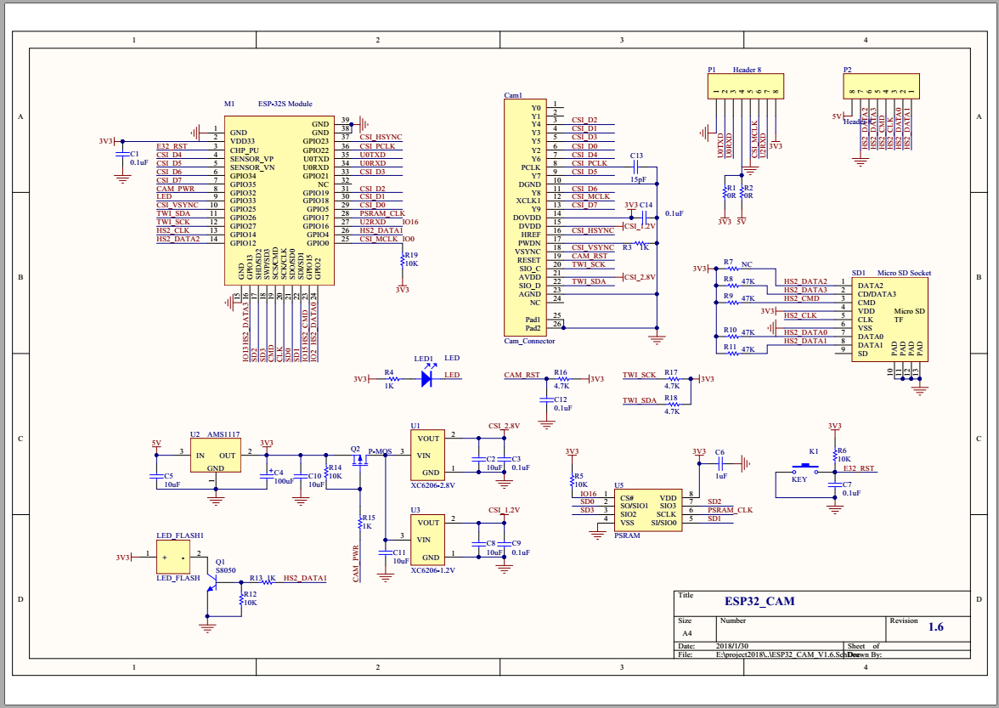
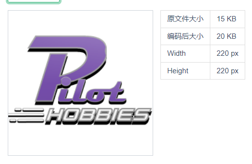
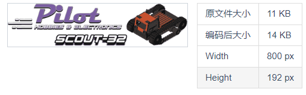
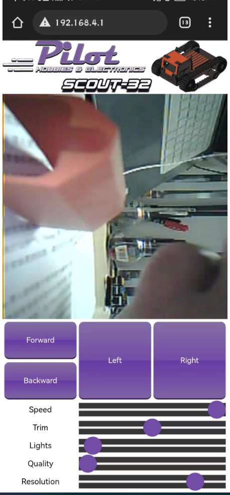

# pio使用对应于arduino框架的v1.0.2版本（pio中为v1.8.0），故修改为使用v1.0.6（pio版本为3.2.0），报错缺少dl_lib.h（arduino版本v1.0.2版本后取消该文件），从别处下载相关库放在include文件夹中

# 该项目在scout32的基础上添加ws2812，使用bliner库实现scout32在此（https://github.com/yang-yang-NO-1/blinker_esp32cam.git）

# 网页图片base64对应，（按照app_server.cpp中出现顺序）
1.


2.


正常运行界面截图


# html部分代码解释
```
<tr><td align="center">Resolution</td><td align="center" colspan="2"><input type="range" id="framesize" min="0" max="6" value="5" onchange="try{fetch(document.location.origin+'/control?var=framesize&val='+this.value);}catch(e){}"></td></tr> 
解释如下：
这段代码是用HTML和JavaScript编写的，用于创建一个表格，其中有一个滑动条，可以调整分辨率的值。当滑动条的值改变时，它会尝试向服务器发送一个请求，传递framesize和val两个参数。代码的解释如下：

- `<tr>`标签表示表格的一行。
- `<td>`标签表示表格的一个单元格。
- `align="center"`属性表示单元格的内容居中对齐。
- `colspan="2"`属性表示单元格跨越两列。
- `<input>`标签表示一个输入元素。
- `type="range"`属性表示输入元素是一个滑动条。
- `id="framesize"`属性表示输入元素的唯一标识符。
- `min="0"`属性表示滑动条的最小值是0。
- `max="6"`属性表示滑动条的最大值是6。
- `value="5"`属性表示滑动条的初始值是5。
- `onchange`属性表示当输入元素的值改变时，执行一段JavaScript代码。
- `try{...}catch(e){}`语句表示尝试执行一段代码，如果出现错误，就忽略它。
- `fetch(...)`函数表示向指定的URL发送一个请求。
- `document.location.origin`表示当前网页的域名部分，例如https://www.bing.com。
- `/control?var=framesize&val='+this.value`表示请求的路径和查询字符串，其中var和val是两个参数，分别传递framesize和滑动条的当前值。this指代输入元素本身。

var fwdpress = new KeyboardEvent('keydown', {'keyCode':38, 'which':38});
解释如下：
这段代码是用JavaScript创建一个键盘事件的对象，表示用户按下了向上箭头键。²³

- var fwdpress 是一个变量，用来存储键盘事件的对象。
- new KeyboardEvent() 是一个构造函数，用来创建一个新的键盘事件的对象。
- 'keydown' 是一个字符串，表示键盘事件的类型，即用户按下了一个键。
- {'keyCode':38, 'which':38} 是一个对象，表示键盘事件的属性，其中keyCode和which都是38，表示向上箭头键的代码值。³⁴

这样，当用户按下向上箭头键时，fwdpress变量就会包含一个描述这个动作的键盘事件的对象。你可以用这个对象来响应用户的输入，比如移动一个角色或者滚动一个页面。

var currentcommand=0;
    var oldcommand=0;
    window.setInterval(function(){
      if (((keyforward) && (keyleft)) || ((keybackward) && (keyleft)) || (keyleft)) {currentcommand = 3;} // Turn Left
      else if (((keyforward) && (keyright)) || ((keybackward) && (keyright)) || (keyright)) {currentcommand = 4;} // Turn Right
      else if (keyforward) {currentcommand = 1;} //Set Direction Forward
      else if (keybackward) {currentcommand = 2;} // Set Direction Backward
      else {currentcommand = 5;} // Stop
      if (currentcommand != oldcommand){
        fetch(document.location.origin+'/control?var=car&val='+currentcommand);
        oldcommand = currentcommand;}
    }, 100);

这段代码是用JavaScript实现一个定时器，每隔100毫秒就向服务器发送一个请求，根据用户按键的情况改变小车的方向。¹²

- var currentcommand 和 var oldcommand 是两个变量，用来存储当前和上一次的命令编号。
- window.setInterval() 是一个函数，用来设置一个定时器，它接受两个参数：一个是要执行的函数，另一个是执行的时间间隔。¹
- function(){} 是一个匿名函数，它在每次定时器触发时被调用。
- if...else if...else 是一个条件语句，用来判断用户按下了哪些键，并根据不同的组合给currentcommand赋值。¹
- if (currentcommand != oldcommand) 是一个判断语句，用来检查当前的命令是否和上一次的命令不同，如果不同，则执行后面的代码块。
- fetch() 是一个函数，用来向服务器发送一个请求，它接受一个参数：一个是要请求的URL。²
- document.location.origin 是一个属性，表示当前文档的域名和端口号。
- '/control?var=car&val='+currentcommand 是一个字符串，表示请求的路径和查询参数，其中var=car表示要控制的是小车，val=表示要发送的命令编号。
- oldcommand = currentcommand 是一个赋值语句，用来更新上一次的命令编号。

这样，当用户按下不同的键时，currentcommand就会改变，并且每隔100毫秒就会向服务器发送一次请求，让小车根据命令改变方向。


```
